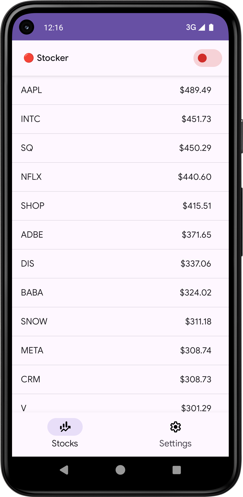
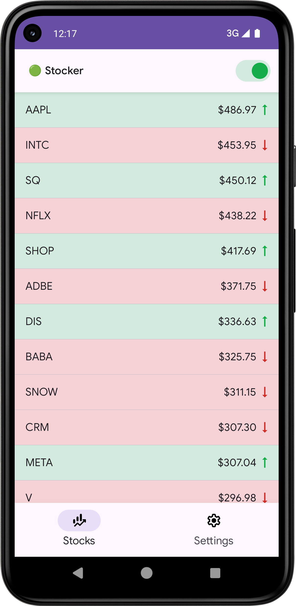
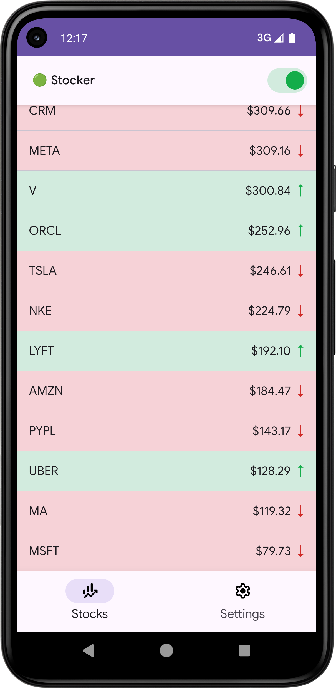
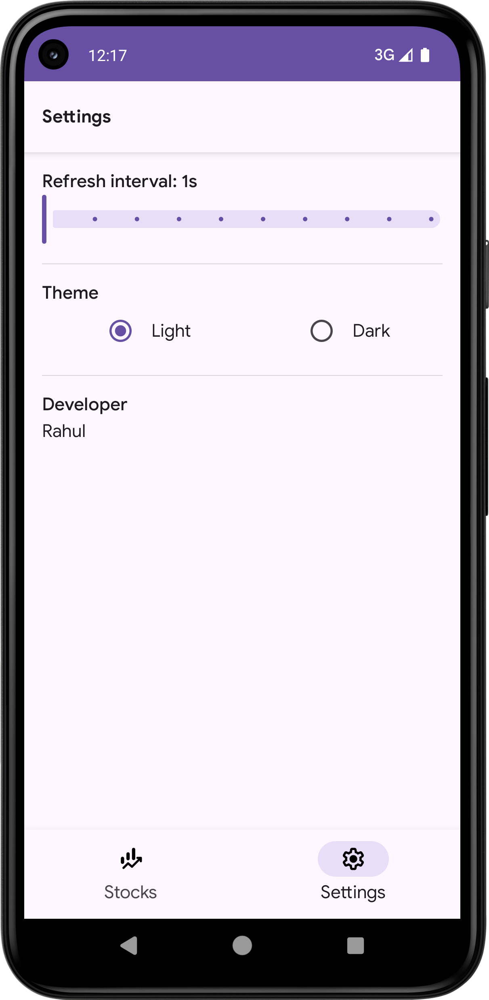
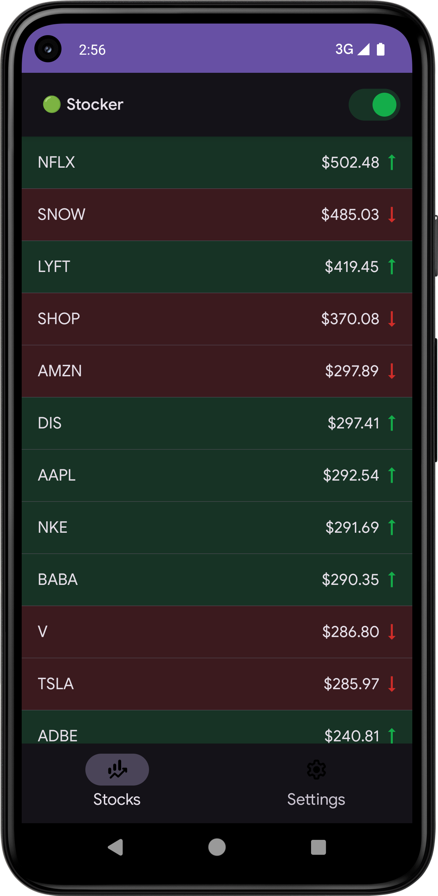
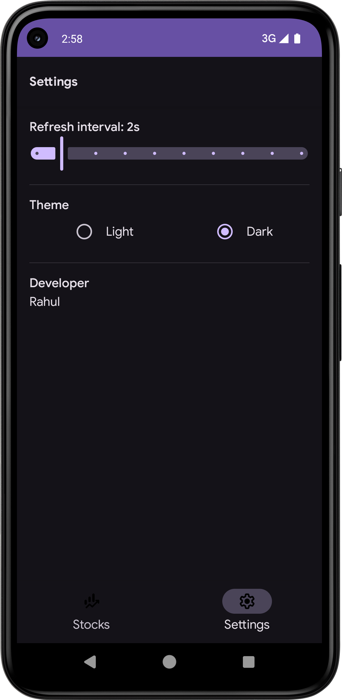

## Stocker App


- An Android app built with 100% Jetpack Compose and MVVM arch
- It tracks stock symbols and streams price updates over a WebSocket wss, showing real-time changes

---

## Quick start

### Prerequisites
- Android Studio (latest preffered)
- JDK 17
- An Android emulator or device (for UI tests)

### Run the app
- Android Studio: Open the project, and Run the `app` configuration.
- CLI:
```bash
./gradlew :app:assembleDebug
./gradlew :app:installDebug
```

### Run tests
- Unit tests:
```bash
./gradlew :app:testDebugUnitTest
```
- UI tests (need a booted emulator/device):
```bash
./gradlew :app:assembleDebugAndroidTest :app:connectedDebugAndroidTest
```

### CI
GitHub Actions workflow is included at `.github/workflows/android-ci.yml` and runs on push/PR:
- Build (assembleDebug)
- Unit tests
- Connected UI tests

---

## Tech Stack

### WebSocket URL
- `WS_URL` environment variable: `wss://ws.postman-echo.com/raw`

---

## Architecture (MVVM lite)

The app follows a straightforward, testable MVVM - with a light weihgt domain layer.

### UI layer
- `Compose` screenss and components
- Previews for all the compose components & screens
- `ViewModel` exposes immutable `ViewState` via `StateFlow` and thin event methods
- No business logic in composables ofcourse!!

### Domain layer
- `domain/model`: `StockModel`, `StockPriceEventModel`
- `domain/repository`: `StocksRepository` (interface the UI depends on)

### Data layer
- `data/remote`: `StockPriceService` (interface) + `StockPriceServiceImpl` (OkHttp WebSocket + Gson)
- `data/repository`: `StockPriceRepositoryImpl` implements `StocksRepository`

### DI
- Hilt modules in `di/` bind concrete implementations and provide shared resources (e.g., symbol list)

### Flow of data
1. `StocksViewModel` calls `repository.start(viewModelScope)` when the user toggles the feed ON.
2. Repository connects WebSocket, periodically sends next prices per symbol, and collects echoed price updates.
3. Each update maps into a `StockModel`, updates in-memory state, sorts by price (desc), and emits a new list.
4. UI observes `ViewState` and renders. Row background highlights green/red while the feed runs and changes occur.

---

## Notable implementation details

- 100% Compose UI
- Material 3 for ui theme
- Kotlin Flow with `StateFlow` for UI state
- OkHttp WebSocket client
- Gson for json serialization
- Hilt for DI
- Custom fonts - `Typography`
- Strings in - `strings.xml`
- Themes - light/dark

---

## Assumptions and trade-offs

- Symbols: A fixed list is injected (DI) for simplicity.
- Price generation: The remote endpoint echoes what we send; we locally generate prices every N seconds so the UI updates reliably.
- Sorting: Stock list is sorted by current price (descending) on each update.
- Row highlight: The bg remains tinted until the next update arrives; when the feed stops, highlights reset.
- Interval: Minimum 1 sec. Defaults to 1 second in UI state; persisted only in-process for the demo.
- Tests: Unit tests focus on logic and state progression; UI tests validate key elements and interactions.

---

## Screenshots / demos

<p align="center">
  
  

</p>

More screenshots:

<div align="center">
  
  
  
  
</div>

Demo video:

- [`Stocker - demo video.webm`](docs/media/Stocker%20-%20demo%20video.webm)

[Stocker - demo video.webm](https://github.com/user-attachments/assets/179c9da2-7afd-439b-9d9a-3f4a9786a88e)

